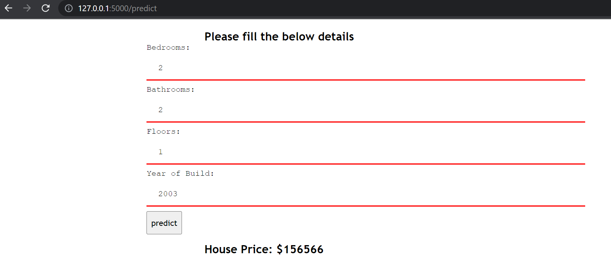

# 🏠 House Price Prediction

This project utilizes Python 🐍, Flask 🌐, and Linear Regression 📈 to predict house prices based on housing data from Kaggle. Whether you're a real estate enthusiast or just curious about predicting house prices, this tool provides an intuitive interface to explore and predict potential prices.

# What is Flask? 🌟

Flask is a lightweight web application framework for Python. It's known for its simplicity and flexibility, making it a popular choice for building web applications, including those with machine learning models like our House Price Prediction tool.

# What is Linear Regression? 📉
Linear Regression is a fundamental statistical method used to model the relationship between a dependent variable and one or more independent variables. In the context of this project, Linear Regression is employed to predict house prices based on various features provided in the housing dataset.

# About the Dataset 📊
The dataset used in this project, house_data.csv, sourced from Kaggle, contains information about various factors that influence housing prices.  
It includes features such as , number of bedrooms, number of bathrooms, floors, and more. These features are utilized by the Linear Regression model to predict house prices.

# How to Use 🚀
To get started with House Price Prediction: 

Clone this repository to your local machine. 
Install Dependencies 
Run the Application  **python app.py**

 

